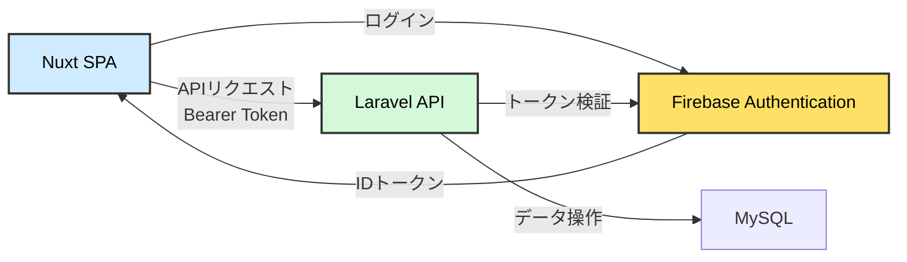
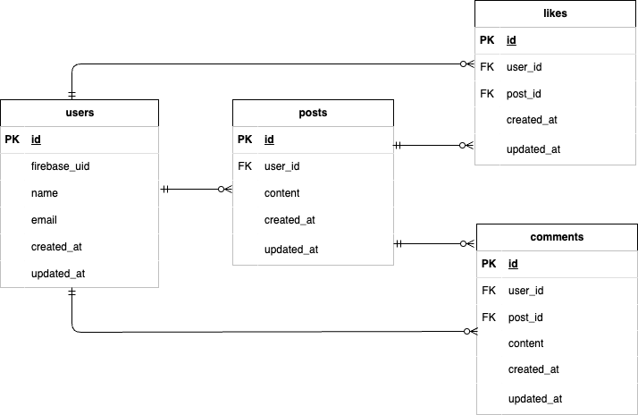

# Twitter風SNSアプリ - (Backend API)

## 概要

Twitter風の簡易SNSアプリのバックエンドAPIです。
フロントエンド（Nuxt 4）と連携し、LaravelでREST APIを構築しています。
フロントエンド（Nuxt）からのリクエストを受け取り、認証・データ処理・DB操作を担当します。

## 作成した目的

- LaravelとNuxtのAPI連携によるモダンなWebアプリ構成の理解
- Firebase Authenticationを用いたトークン認証の実装経験
- フロントエンド／バックエンド分離構成での開発演習

## 関連リポジトリ

- Frontend: https://github.com/okumurachie/Twitter-frontend
- Backend: https://github.com/okumurachie/Twitter-backend

## アプリケーションURL

※ 本アプリはローカル環境での動作を前提としています。デプロイは行っていません。

## 使用技術

- PHP 8.2
- Laravel 12
- MySQL
- Firebase Authentication(トークン検証)
- REST API

## 主な機能

- 投稿の一覧表示
- 投稿作成・削除(認証ユーザーのみ)
- いいね機能(重複防止)
- コメント機能
- 認証ユーザーのみ操作可能なAPI制御
- Firebase IDトークンの検証(ミドルウェア)
- 自身の投稿のみ削除可能

## API設計

本アプリではREST APIとしてエンドポイントを設計しています。

### 例

- GET /api/posts → 投稿一覧取得
- POST /api/posts → 投稿作成
- DELETE /api/posts/{post} → 投稿削除(投稿者のみ)

フロントエンドからのリクエストには、Firebaseで取得したIDトークンをBearerトークンとして付与します。

## 認証処理

- フロントエンドで取得したFirebase IDトークンを受け取り、Laravel側で検証しています。
- ミドルウェアでトークンの有効性を確認し、認証済みユーザーのみAPIアクセスを許可しています。

## システム構成

## テーブル設計

## ER図

## 設計のポイント

- Eloquentリレーションを活用し、投稿・コメント・いいねの関係性を管理
- コントローラーではリレーション経由でデータを操作し、可読性と保守性を向上
- N+1問題を防ぐため、Eager Loadingを意識した実装

## 今後の課題

- APIの設計改善（リソース設計・レスポンス統一）
- 認可（Policy）の導入による権限制御の強化
- パフォーマンス改善（クエリ最適化）
- 画像投稿対応（Storage連携）
