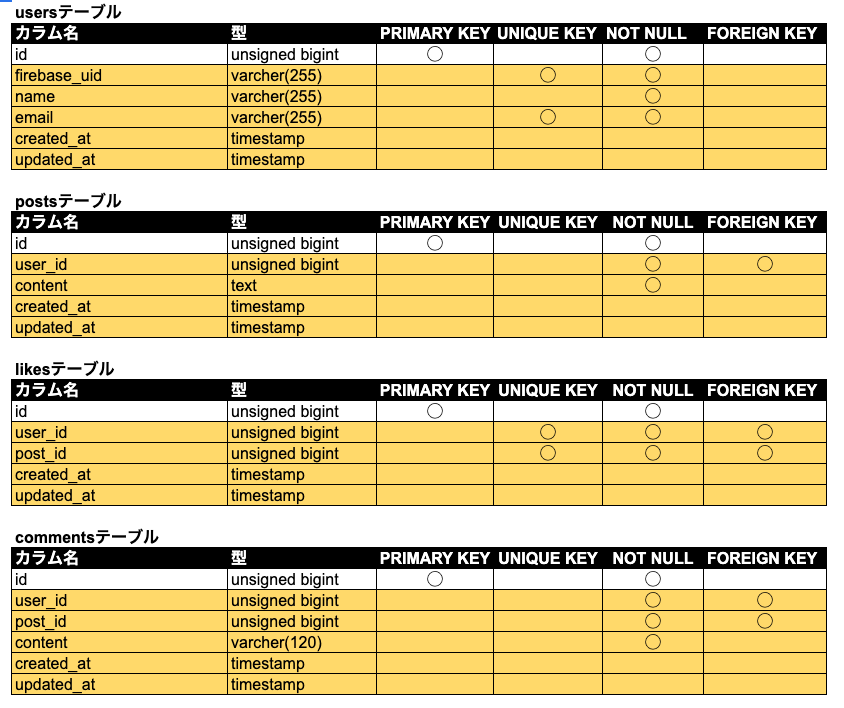

# Twitter風SNSアプリ - (Backend API)

## 概要

Twitter風の簡易SNSアプリのバックエンドAPIです。
フロントエンド（Nuxt）と連携し、LaravelでREST APIを構築しています。

## 作成した目的

- LaravelとNuxtのAPI連携によるモダンなWebアプリ構成の理解
- Firebase Authenticationを用いたトークン認証の実装経験
- フロントエンド／バックエンド分離構成での開発演習

## 関連リポジトリ

- Frontend: https://github.com/okumurachie/Twitter-frontend
- Backend: https://github.com/okumurachie/Twitter-backend

## アプリケーションURL

※ 本アプリはローカル環境での動作を前提としています。デプロイは行っていません。

# 環境構築手順（ローカル開発用）

## 1.リポジトリをクローン

- git clone git@github.com:okumurachie/Twitter-backend.git
- cd Twitter-backend

## 2. .envファイル作成

- cp .env.example .env
  (.env.example ファイルから.env を作成し、環境変数を変更)

                    DB_CONNECTION=mysql
                    DB_HOST=127.0.0.1
                    DB_PORT=3306
                    DB_DATABASE=twitter_sns_db
                    DB_USERNAME=root
                    DB_PASSWORD=

## 3.依存パッケージインストール

- composer install
- php artisan key:generate

### Firebase設定

    本アプリでは Firebase Authentication を使用しています。

    1.動作させるには、Firebaseプロジェクトを作成し、
    サービスアカウントキー(JSON)を取得してください。

    2.取得したJSONファイルを以下の場所に配置してください。
    storage/firebase/firebase.json

    3. .env に以下を設定してください。

    FIREBASE_CREDENTIALS=storage/firebase/firebase.json
    FIREBASE_PROJECT_ID=your-project-id
    ※UID関連の設定は不要です。(Seederユーザーはダミーのため)

### DB初期化とシーディング

- php artisan migrate:fresh --seed
  (初期表示用のダミーデータを作成)
- php artisan serve
  (バックエンドサーバー立ち上げ)

#### 注意事項(ダミーユーザーについて)

- Seederで作成されるユーザー(Test User1 / Test User2)は初期画面の表示用ダミーデータです。
- UIDはダミーのため、Firebase上には存在しません。そのため、削除や投稿などログインユーザーに紐づく操作は行えません。
- 操作確認は、「新規登録」からユーザーを作成し、そのユーザー（例：Test User3）でログインの上、操作を行なってください。
- Seederユーザーは表示や投稿閲覧用として利用します。

## システム構成

Frontend（Nuxt3） 
↓ REST API 
Backend（Laravel） 
↓ 
MySQL

## 使用技術

- PHP 8.4.8
- Laravel 12
- MySQL
- Firebase Authentication（IDトークン認証）

## 主な機能

- ユーザー認証(Firebase Authentication)
- 投稿の一覧表示
- 投稿作成・削除
- いいね機能
- コメント機能
- 投稿追加・削除・コメント追加・いいね機能は認証ユーザーのみ操作可能。投稿削除は自身の投稿のみ可能。
- Seederユーザーは表示用で操作不可

## 使い方（ローカル確認）

- 1.フロントエンドを起動（https://github.com/okumurachie/Twitter-frontendからクローン）
- 2.Firebaseでユーザー登録（Test User3など）
- 3.投稿作成・投稿削除・いいね・コメント作成を操作（Seederユーザーは表示用で操作不可）

## テーブル設計

## ER図

## 開発環境

- 商品一覧画面（トップ画面）：http://localhost:3000/
- 会員登録：http://localhost:3000/register
- ログイン:http://localhost:3000/login

# Twitter-backend
